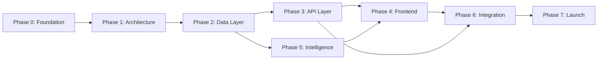

# NeuroVenue OS — Task Plan

> **Version:** 0.1.0  
> **Last Updated:** 2026-04-10  
> **Status:** Draft — Pre-Execution

---

## Phase Overview

```
Phase 0: Foundation & Research       ██████████ ← YOU ARE HERE
Phase 1: Core Architecture           ░░░░░░░░░░
Phase 2: Data Layer & Pipelines      ░░░░░░░░░░
Phase 3: API & Service Layer         ░░░░░░░░░░
Phase 4: Frontend Shell              ░░░░░░░░░░
Phase 5: Intelligence Engine         ░░░░░░░░░░
Phase 6: Integration & Polish        ░░░░░░░░░░
Phase 7: Launch Preparation          ░░░░░░░░░░
```

---

## Phase 0 — Foundation & Research
> **Goal:** Establish project scaffolding, research domain, define architecture.  
> **Milestone:** All documentation approved; tech stack finalized.

| Task ID | Task | Status | Notes |
|---------|------|--------|-------|
| NV-001 | Create project constitution (`claude.md`) | ✅ Done | v0.1.0 |
| NV-002 | Define JSON schemas (`gemini.md`) | ✅ Done | Core schemas drafted |
| NV-003 | Build task plan (`task_plan.md`) | ✅ Done | This document |
| NV-004 | Document initial research (`findings.md`) | ✅ Done | Initial entries |
| NV-005 | Initialize progress log (`progress.md`) | ✅ Done | First session logged |
| NV-006 | Competitive landscape research | ⬜ Not Started | Identify existing venue intelligence platforms |
| NV-007 | Finalize tech stack decision | ⬜ Not Started | Runtime, DB, hosting, CI/CD |
| NV-008 | Define system architecture diagram | ⬜ Not Started | C4 context + container level |
| NV-009 | Set up CI/CD pipeline skeleton | ⬜ Not Started | GitHub Actions or equivalent |
| NV-010 | Create `.env.example` and config loader | ⬜ Not Started | — |

---

## Phase 1 — Core Architecture
> **Goal:** Set up the monorepo, project scaffolding, and foundational configs.  
> **Milestone:** `npm run dev` boots cleanly with no features.

| Task ID | Task | Status | Notes |
|---------|------|--------|-------|
| NV-011 | Initialize monorepo structure | ⬜ Not Started | Turborepo or Nx |
| NV-012 | Configure TypeScript (strict mode) | ⬜ Not Started | Shared `tsconfig.base.json` |
| NV-013 | Set up linting & formatting | ⬜ Not Started | ESLint flat config + Prettier |
| NV-014 | Set up testing framework | ⬜ Not Started | Vitest for unit; Playwright for E2E |
| NV-015 | Implement base error handling utilities | ⬜ Not Started | `Result<T,E>`, `AppError` class |
| NV-016 | Create logging infrastructure | ⬜ Not Started | Structured JSON logs (pino) |

---

## Phase 2 — Data Layer & Pipelines
> **Goal:** Database schema, ORM setup, data ingestion pipeline.  
> **Milestone:** Seed data loads; CRUD operations pass tests.

| Task ID | Task | Status | Notes |
|---------|------|--------|-------|
| NV-020 | Choose and configure database | ⬜ Not Started | PostgreSQL + Drizzle ORM (candidate) |
| NV-021 | Implement `venues` table migration | ⬜ Not Started | Maps to `gemini.md` Venue schema |
| NV-022 | Implement `events` table migration | ⬜ Not Started | Maps to `gemini.md` Event schema |
| NV-023 | Implement `venue_scores` table migration | ⬜ Not Started | Maps to `gemini.md` VenueScore schema |
| NV-024 | Build venue service (CRUD) | ⬜ Not Started | — |
| NV-025 | Build event service (CRUD) | ⬜ Not Started | — |
| NV-026 | Create seed data script | ⬜ Not Started | Realistic mock venues + events |
| NV-027 | Design data ingestion pipeline | ⬜ Not Started | External data sources TBD |

---

## Phase 3 — API & Service Layer
> **Goal:** RESTful endpoints for all core resources.  
> **Milestone:** All CRUD endpoints pass integration tests.

| Task ID | Task | Status | Notes |
|---------|------|--------|-------|
| NV-030 | Set up API server (Hono or Express) | ⬜ Not Started | — |
| NV-031 | Implement venue endpoints | ⬜ Not Started | GET, POST, PUT, DELETE |
| NV-032 | Implement event endpoints | ⬜ Not Started | GET, POST, PUT, DELETE |
| NV-033 | Implement venue score endpoints | ⬜ Not Started | GET (read-only for clients) |
| NV-034 | Add request validation middleware | ⬜ Not Started | Zod with schema alignment |
| NV-035 | Add authentication middleware | ⬜ Not Started | JWT or API keys TBD |
| NV-036 | Add rate limiting | ⬜ Not Started | — |
| NV-037 | Write OpenAPI specification | ⬜ Not Started | Auto-generated from Zod schemas |

---

## Phase 4 — Frontend Shell
> **Goal:** Dashboard UI with navigation, layout, and design system.  
> **Milestone:** Empty dashboard renders with navigation and auth gate.

| Task ID | Task | Status | Notes |
|---------|------|--------|-------|
| NV-040 | Initialize Next.js app | ⬜ Not Started | App Router, strict TS |
| NV-041 | Build design system tokens | ⬜ Not Started | Colors, typography, spacing |
| NV-042 | Create shell layout (sidebar + header) | ⬜ Not Started | — |
| NV-043 | Build venue list view | ⬜ Not Started | Table + card toggle |
| NV-044 | Build venue detail view | ⬜ Not Started | Score breakdown, events |
| NV-045 | Build event calendar view | ⬜ Not Started | — |
| NV-046 | Implement auth flow (login/signup) | ⬜ Not Started | — |

---

## Phase 5 — Intelligence Engine
> **Goal:** AI scoring pipeline that generates venue intelligence.  
> **Milestone:** Scores are generated for all seeded venues.

| Task ID | Task | Status | Notes |
|---------|------|--------|-------|
| NV-050 | Design scoring algorithm | ⬜ Not Started | Multi-dimensional weighted model |
| NV-051 | Build scoring pipeline | ⬜ Not Started | Batch + on-demand |
| NV-052 | Integrate external data sources | ⬜ Not Started | Reviews, footfall, etc. |
| NV-053 | Build confidence calibration | ⬜ Not Started | Based on data completeness |
| NV-054 | Create score visualization components | ⬜ Not Started | Radar chart, trend lines |

---

## Phase 6 — Integration & Polish
> **Goal:** Connect all layers; polish UX; handle edge cases.  
> **Milestone:** Full flow works end-to-end with real data.

| Task ID | Task | Status | Notes |
|---------|------|--------|-------|
| NV-060 | End-to-end integration testing | ⬜ Not Started | — |
| NV-061 | Performance optimization | ⬜ Not Started | DB queries, SSR, caching |
| NV-062 | Accessibility audit | ⬜ Not Started | WCAG 2.2 AA |
| NV-063 | Mobile responsiveness pass | ⬜ Not Started | — |
| NV-064 | Error state handling (empty, loading, failed) | ⬜ Not Started | — |

---

## Phase 7 — Launch Preparation
> **Goal:** Production readiness, documentation, deployment.  
> **Milestone:** System deployed and monitored in production.

| Task ID | Task | Status | Notes |
|---------|------|--------|-------|
| NV-070 | Write deployment runbook | ⬜ Not Started | — |
| NV-071 | Set up monitoring & alerting | ⬜ Not Started | Uptime, errors, latency |
| NV-072 | Write user documentation | ⬜ Not Started | — |
| NV-073 | Security audit | ⬜ Not Started | OWASP Top 10 review |
| NV-074 | Production deployment | ⬜ Not Started | — |

---

## Dependency Graph



---

> **Next Action:** Complete NV-006 through NV-010 to close Phase 0.
